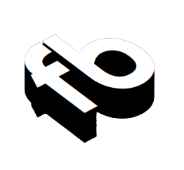

# Hello World 

- 🔦 I’m currently open for a new role and/or projects to work for/with
- 🔌 Most used line of code `pip install`
- 🔍 I’m looking for ressources on Django, Numpy, Three JS, Blender
- 📫 How to reach me: ziscoplankton@gmail.com
- 🧲 Fun fact: I've worked 20+ hours shifts


<br><br>

<details>
<summary>
    About the website
</summary>

<br>

# 💡Concept
The idea was to have no colours and be as minimalistic as possible but informational and without interfering with the user's experience. It is complemented with Bootstrap components:
- Button
- Modal
- Navbar
- Offcanvas
- Popovers

These elements helped me to create clean layout, interactions and create additional values to the viewer

<br>

# 👨‍🔧Build
<div margin="2">


<br><br>
</div>


# 🧊 Isometry
I really enjoyed getting some exposure to 3d rendering with css. It gave me a clear test on how cool ThreeJS and Blender would be ! 
Here is bits of the css if you want to create forms:
```
.container .cube div span::before
{
    content: '';
    position: absolute;
    left: -40px;
    width: 40px;
    height: 100%;
    background-color: #FFF;
    transform-origin: right;
    transform: skewY(45deg);
    transition: 1.5s;
    border: 1px lightgray solid;
    border-radius: 1%;
}
```
The `::before` and `::after` selectors with the properties `content` and `position` are the foundations.

<br><br>

# 🎭 Logo
<div align="center"> 
    
</div>

```
var text = document.getElementById('text');
var shadow = '';
for (var i = 0; i < 20; i++) {
    shadow += (shadow? ',':'') + -i * 1 + 'px ' + i * 1 + 'px 0 #000';
}
text.style.textShadow = shadow;
```
This loop increment the variable shadow depending on a condition
by `-i * 1` or `i * 1`.
This creates the logo effect on:
```sh
<div class="navbar-brand-div rounded-5 m-5 mt-0">
    <a class="nav-a" href="index.html" id="text">fb</a>
</div>
```

<br>


## Author

👤 **FB**

* Website: [Home](https://ziscoplankton.github.io)
* Github: [@ziscoplankton](https://github.com/ziscoplankton)

<br><br><br>

## Support

Give a ⭐️ if this project helped you or if you just liked it!

<br>

## Contribute

If you have any suggestions or improvements, please feel free to submit a pull request.

<br>

# Sources

> [**Open Tutorials for isometry**](https://www.youtube.com/@OnlineTutorialsYT)

> [**Git Hub Pages for hosting**](https://pages.github.com/)


</details>
