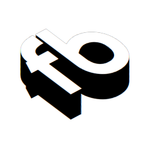

# Welcome ! 

### :man_technologist: About This website

Thank you for visiting this repo and hopefully the actual website.

It uses entirely HTML, CSS and a bit of JavaScript. 

The framework is Bootstrap and I created isometry with CSS using a few tutorials to get my head around the process. It helped to properly grasp on elements and choose their positions.

### Sources

> [**Open Tutorials**](https://www.youtube.com/@OnlineTutorialsYT)

> [**GitHubPages**](https://pages.github.com/)